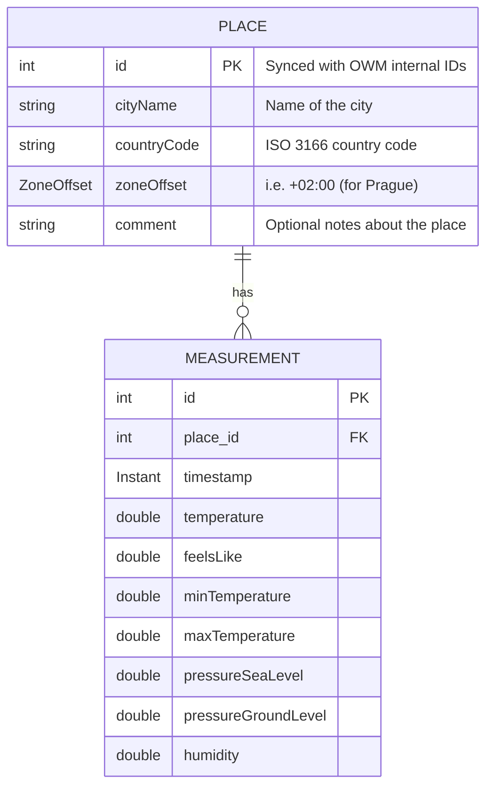

# CloudQuery

## Configuration

- Everything that should be configurable is done so via environment variables
- The following Spring profiles are used:
  - `dev` - for local development (only enables Hibernate migrations)
  - `test` - for running the tests (Hibernate create-drop migrations + OWM API key placeholder)

## Data model



## Logging

- In the code, lombok's `@Slf4j` is used to create the logger instances
- [Logback](https://logback.qos.ch/) is then used for logging

## Tests

Persistent(repositories) and service layers are tested using JUnit 5 and Mockito and can be run using the Maven `test` target

```shell
mvn test
```

### Logback configuration

The configuration file is located in `src/main/resources/logback-spring.xml`

```xml
<?xml version="1.0" encoding="UTF-8"?>
<configuration>
    <!-- Preserve the default Spring logging configuration (stdout, colors, etc..) -->
    <include resource="org/springframework/boot/logging/logback/base.xml"/>

    <!-- As per the requirements - additional file output -->
    <property name="LOG_FILE" value="log.out"/>

    <!-- It seemed appropriate to log API calls from the OWM SDK I'm using -->
    <logger name="com.github.prominence" level="DEBUG"/>
</configuration>

```

## Weather API

- The **OpenWeatherMap API** is used to fetch the weather data
- A [3rd party library](https://github.com/Prominence/openweathermap-java-api) is used to interact with the API
- The application expects the API key to be set in the environment variable `OPENWEATHERMAP_APIKEY`